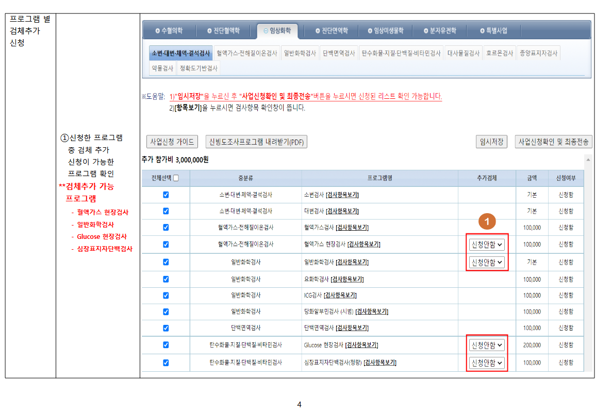

# 🛠️ 유지보수 업무 경험

## 🗂️ DB 테이블 구조 관리
- 로직과 맞지 않는 데이터 타입/길이를 가진 DB 테이블 구조 식별 및 수정

## 🚀 DB 튜닝
- SQL Optimizer 원리를 활용하여 쿼리 수행 시간 단축
- 주로 Stored Procedure, View, User-defined Function 대상으로 최적화 수행
- 인덱스 원리 기반 튜닝 수행
  - 예: Cluster Index, Non-cluster Index, Composite Index, Index Seek 등

## 🔧 레거시 소스 코드 리팩토링 및 수정
- 가독성이 떨어지는 기존 코드를 유지보수 용이하게 정리
- 주석이 없는 코드에 주석 추가 및 로직 설명
- 비정상적인 로직 검토 및 수정

## 🖨️ 요청 데이터 출력 및 통계/DB CRUD 자동화
- 대학병원 교수의 요청 데이터 출력 (예: 수혈검사 원자료)
- 교수 보고서용 통계 출력 (예: 2023년 칼슘검사 평균, 표준편차 등)
- 수기 작업이 필요한 DB CRUD 작업을 프로시저화하여 자동화
  * 예시: 검사항목, 기기, 시약 등 매번 반기별로 달라지는 데이터 CRUD 자동화

## 📘 사용자 매뉴얼 제작
- 사용자들이 시스템을 원활히 사용할 수 있도록 기능 매뉴얼 문서 제작    
- 

# 🛠️ Maintenance Work Experience

## 🗂️ Database Table Structure Management
- Identified and modified database table data types or lengths that didn't match logical requirements

## 🚀 Database Tuning
- Reduced query execution time using SQL Optimizer principles
- Optimized Stored Procedures, Views, and User-defined Functions
- Applied indexing concepts effectively
  - Examples: Cluster Index, Non-cluster Index, Composite Index, Index Seek, etc.

## 🔧 Refactoring & Modifying Legacy Source Code
- Improved poorly written legacy code for maintainability
- Added meaningful comments to uncommented code to explain logic
- Reviewed and corrected logic inconsistencies

## 🖨️ Request Data Print & Statistics / Automation of Manual CRUD
- Printed requested data from university hospital professors (e.g., blood transfusion raw data)
- Created statistical reports (e.g., calcium test averages, standard deviation for 2023)
- Automated manual DB CRUD by converting workflows into stored procedures
  * Example: Automated CRUD operations for data that changes every half-year, such as test items, equipment, and reagents.

## 📘 User Manual Creation
- Created documentation to guide users in using the system smoothly
- 