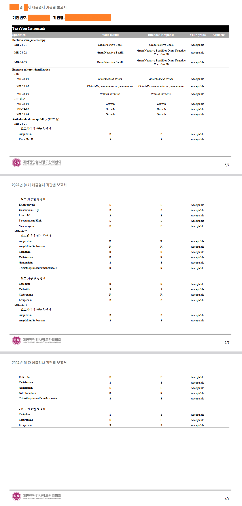

# ⚙️ 업무 자동화 및 시스템 개선 내역

## 📝 결과 리포트 출력 업무 자동화

- **📌 배경**  
  혈액, 소변, 조직, 세균, 유전자 등 다양한 검사항목에 따라 결과 리포트 양식이 달라 예외 처리도 많고, 리포트 생성 시마다 수작업 소요 시간이 큼.

- **🛠️ 개선 내용**  
  각기 다른 검사항목의 결과 구조와 예외사항을 SQL 프로시저로 모듈화하여 자동화 배치 작업이 가능한 SQL 프로그램 개발.

- **✅ 성과**  
  - 리포트 생성 과정을 일괄 자동화함으로써 정확도 및 속도 향상.  
  - 특히 세균검사처럼 자유 입력 방식이 필요한 항목도 수작업 없이 자동 생성.  
  - 수작업 대비 평균 리포트 생성 시간 대폭 단축.

- **🖼️ 세균검사 리포트 예시**     
  - 
---

# 🛠️ Automation & System Improvement Highlights (English)

## 📝 Automation of User Report Generation Process

- **📌 Background**  
  Report formats and data logic varied greatly by test type (blood, urine, tissue, bacteria, genetics, etc.), requiring manual adjustments and extensive time due to inconsistent formats and numerous exceptions.

- **🛠️ Improvement**  
  Modularized test-specific logic and exceptions into SQL procedures to allow for batch report data generation via a single SQL program.

- **✅ Results**  
  - Streamlined report generation with improved accuracy and reduced time.  
  - Successfully automated even complex tests like bacterial reports where users freely select test items (e.g., antibiotics).  
  - Reduced manual work and increased reporting consistency across test types.

- **🖼️bacterial report e. g.**    
  - 
