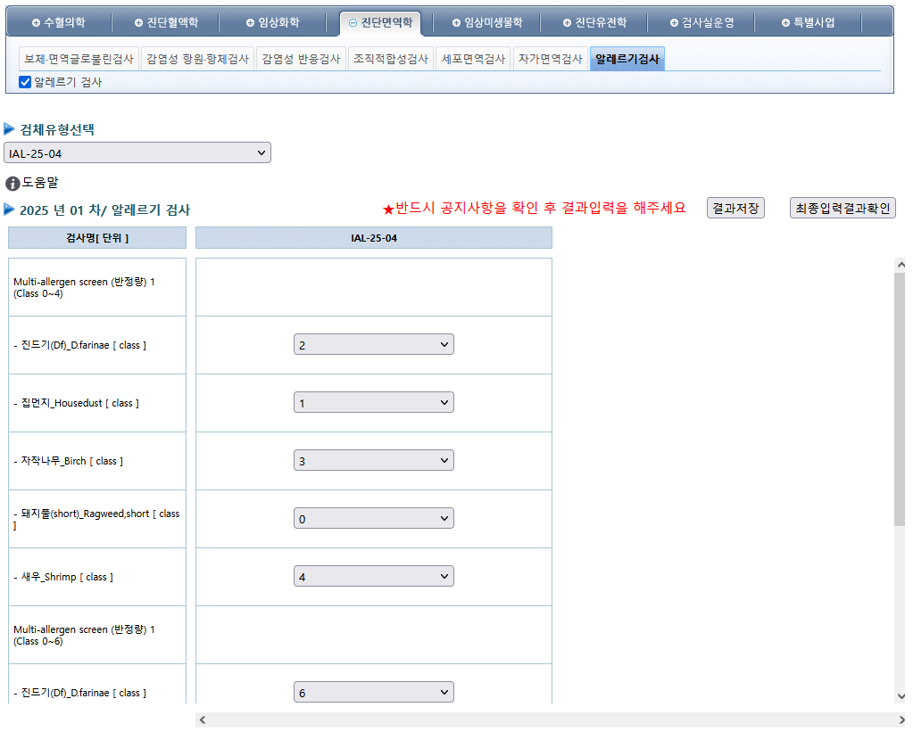

# ⚙️ 업무 자동화 및 시스템 개선 내역

## 🧪 예외 검사 결과입력화면 자동 세팅 시스템 개발

- **📌 배경**  
  유전체, 알레르기 검사처럼 검사 항목이 수시로 바뀌는 비정형 검사는 결과입력 화면을 검사마다 수작업으로 구성해야 했으며, 이로 인해 업무 효율 저하 발생.

- **🛠️ 개선 내용**  
  검사 항목 변경 시 결과입력화면이 자동으로 설정되는 시스템 구축. 항목 정의만 하면 UI가 자동 구성되도록 설계.

- **✅ 성과**  
  - 유전체/알레르기 검사 항목의 입력 UI를 자동 생성하여 수작업 제거.  
  - 분자세포유전, NGS 검사 등 정기적으로 새로 정의되는 항목도 자동 적용.  
  - 검사 시스템 유연성 및 실무 대응 속도 향상.

- **🖼️ 알레르기 결과입력화면 예시**   
  - 
---

# 🛠️ Automation & System Improvement Highlights (English)

## 🧪 Auto-Configuration System for Exceptional Test Entry Screens

- **📌 Background**  
  Genetic and allergy tests often have test items that change each time, requiring the results entry UI to be manually reconfigured for every cycle—leading to inefficiencies.

- **🛠️ Improvement**  
  Developed a system that automatically sets up the result entry UI based on dynamically defined test items, eliminating manual UI configuration.

- **✅ Results**  
  - Fully automated dynamic screen setup for non-standard tests like genomics and allergies.  
  - Examples include molecular cytogenetic tests and NGS, which are regularly updated.  
  - Greatly improved operational speed and adaptability of the system.

- **🖼️ Allergic Result Entry UI e. g.**   
  - 