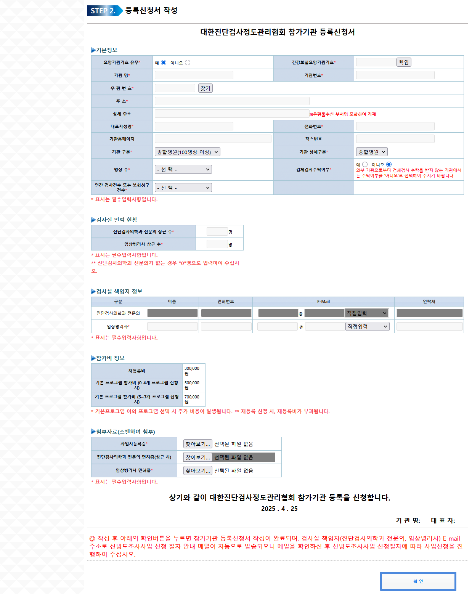
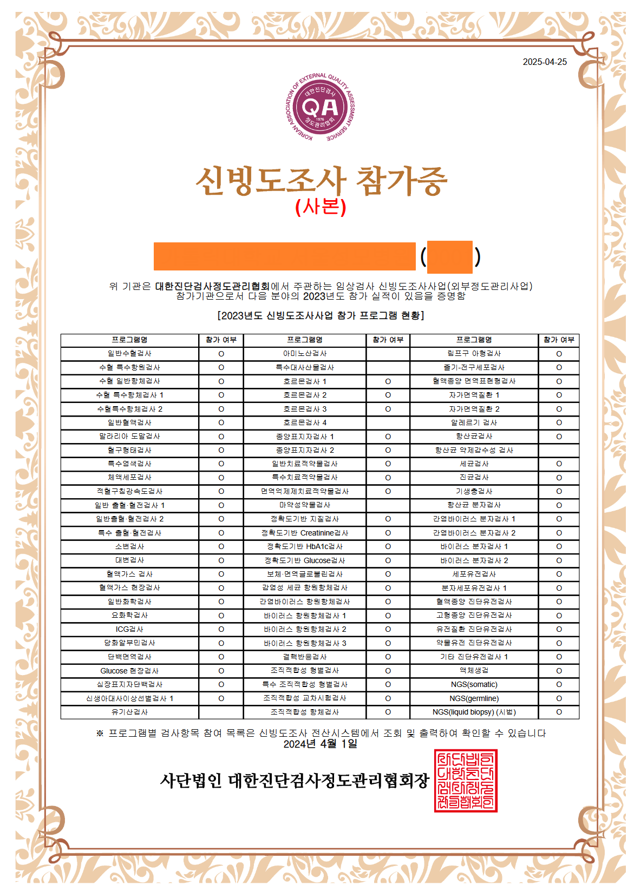
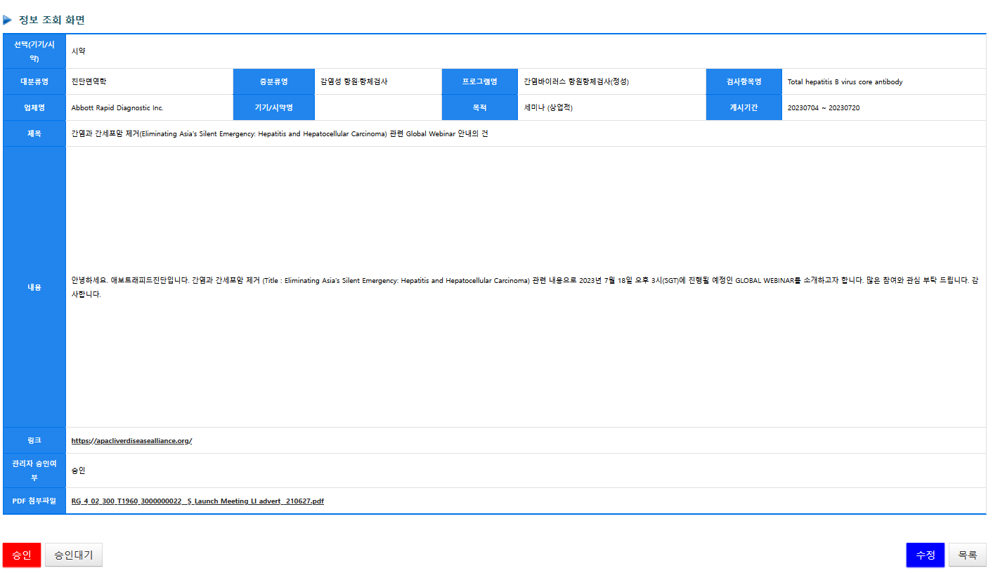
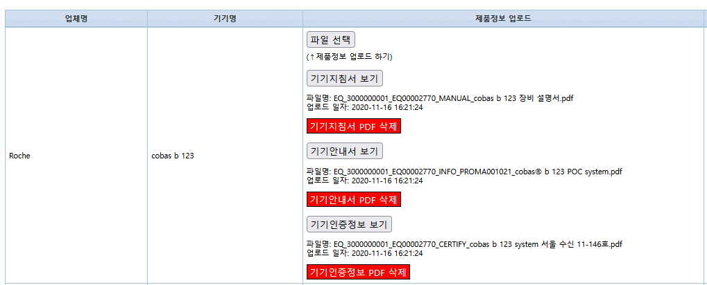
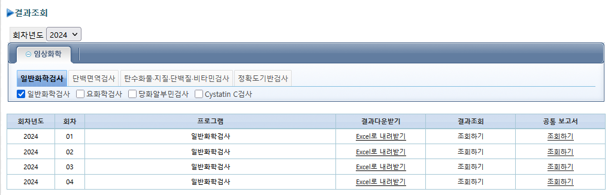
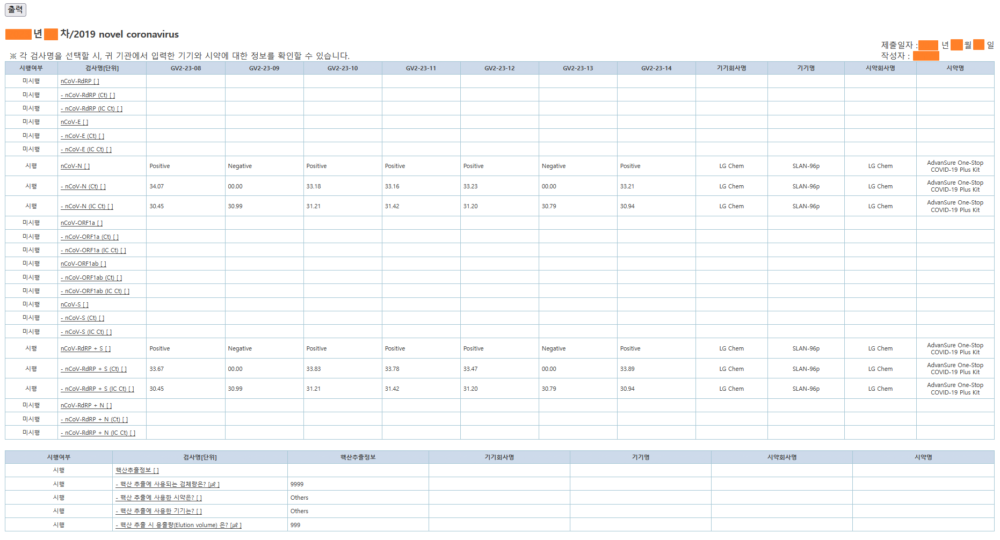
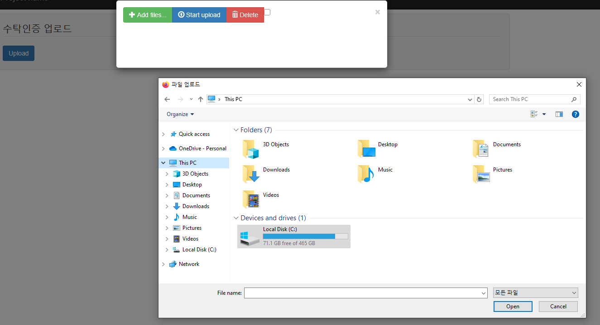

# 💼 추가 개발 경험 요약

## 🔁 RE:가입 유저 멤버십 로직 개발
- 병원 관계자가 재가입 시 일정 금액(상한선 존재)을 지불하여 멤버십 재가입 가능하도록 설계한 수익형 로직 개발
- 

## 📜 병원에 배포되는 검사 결과 인증서 데이터 통합 관리 로직
- 병원 관계자 및 인증서 관리자 대상
- '대한임상외부정도관리협회' 공식 인증서를 관리하는 로직
- 

## 🤖 허용 판정 자동화 로직
- 교수진이 사용하는 로직
- SQL 및 알고리즘을 활용한 데이터 기반 판정값 자동 도출
- 수작업 대비 500% 이상 시간 절감 효과
- 

## 🚚 샘플 실시간 위치 조회 및 배송 상태 분석/통계 로직
- 병원 관계자 및 배송 관리자 대상
- 병원 배송 샘플의 실시간 위치 확인, 문제 발생 여부 파악 가능
- 

## 💰 장비/시약 업체 대상 유료 시스템 로직 (Roche, Siemens 등)
- 자사 장비/시약과 함께 입력된 결과 데이터 확인 가능
- PDF, 링크 업로드 및 광고 기능 포함
- 
- 
- 

## 🦠 코로나19 샘플 결과 입력 전용 로직
- 혈액, 소변 레이아웃에 추가된 항목 구성
- 100% 입력 원칙에 맞춘 병원별 검사 항목 생성 및 설문 결과 반영
- 

## 🛠️ 기타 업무 로직 다수 개발
- 비개발자 업무 효율화를 위한 자동화 로직 개발
  - 예: Excel 업로드 시 자동으로 MS-SQL 데이터로 변환되는 기능 등
  - 

# 💼 Additional Development Experience Summary

## 🔁 Re:Join Membership Logic
- Designed a profitable logic where hospital personnel can rejoin user membership by paying a capped fee after expiration
- 

## 📜 Certificate Data Management Logic
- Used by hospital personnel and certificate administrators
- Manages authoritative test result certificates issued by the Korean Association of External Quality Assessment Service
- 

## 🤖 Automated Acceptability Determination Logic
- Logic used by executive professors
- Automatically determines expected acceptable values using SQL and algorithms
- Reduced manual calculation time by over 500%
- 

## 🚚 Real-time Sample Delivery Tracking & Statistics
- Real-time location tracking and delivery status statistics for hospital-bound samples
- Enables hospital staff and delivery managers to detect process issues
- 

## 💰 Paid System Logic for Equipment/Reagent Companies (e.g., Roche, Siemens)
- Allows companies to view sample data related to their products
- Upload PDFs or links and advertise publicly or commercially
- 
- 
- 

## 🦠 COVID-19 Sample Result Input Logic
- Additional COVID-19-specific functions added to existing sample result input UI (e.g., blood, urine)
- Included custom survey inputs and enforced full result input policy by hospital
- 

## 🛠️ Additional Logic Developments
- Created multiple business logics for non-developer efficiency
  - Example: Auto-conversion of Excel upload data to MS-SQL database format
  - 
  
