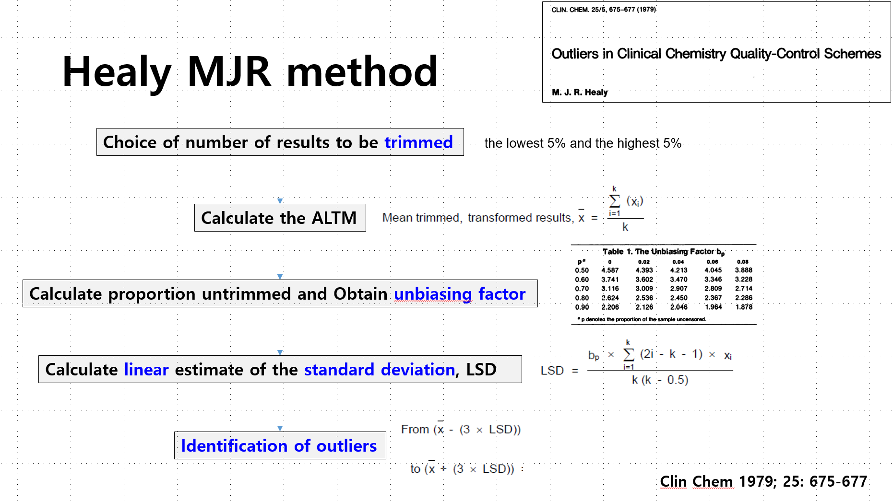

# 윤한진 / Hanjin Yun Resume

## 📌 기본정보 / Personal Info
- **이름 / Name**: 윤한진 / Hanjin Yun
- **생년월일 / DOB**: 1998년 6월 11일 / June 11, 1998
- **주소 / Address**: 서울 강서구 곰달래로 51길 43 연화아트 B01호
- **연락처 / Phone**: 010-2926-7026 (+82-10-2926-7026)
- **이메일 / Email**: cowardrrone98@gmail.com
- **병역사항 / Military Service**: 군필 / Completed

## 🎓 학력 / Education
- **수도전기공업고등학교 (Sudo Electric Technical High School)**
  - 전공: 전기에너지과 (Major: Electrical Energy)
  - 재학기간: 2014.03 ~ 2017.02

## 💼 경력 / Work Experience
### (주)에이씨케이 / ACK Co., Ltd
- **재직기간**: 2018.08.06 ~ 2025.02.28 (6년 7개월)
- **부서 / Department**: Solution 사업부
- **직급 / Position**: 대리 / Assistant Manager
- **기술스택 / Tech Stack**: ASP.NET, HTML, CSS, JavaScript, C#, MS-SQL, Git
- **주요업무 / Highlights**:
  - **대한진단검사정도관리협회 신빙도조사사업 웹사이트 총괄 PM 및 Full Stack 개발자**
  - 연간 1억 규모 유지보수 및 추가개발 계약 성사
  - **정도관리협회 업무 매뉴얼 직접 기획 및 집필 (50p 이상 분량의 실무 문서)**
     * 
  - Report 자동화: 예외사항 많은 검사 항목에 대해 SQL 프로시저 모듈화하여 작업 시간 대폭 단축 [자세히 보기](./detail_1.md)
  - 유전체/알레르기 검사 입력 UI 자동화 시스템 개발 [자세히 보기](./detail_2.md)
  - 다양한 요구사항 기반 비즈니스 로직 개발: 유저 재가입, 샘플 인증서, 실시간 배송 상태 분석, COVID-19 결과 입력 시스템, 허용 판정 자동화 로직 등 [자세히 보기](./detail_3.md)
  - Healy Method 통계 시뮬레이터 개발 (출력되는 통계 데이터 개별적 관리 용이한 Excel VBA 활용, chatGPT 활용하여 개발 & 실무에 안정적으로 적용, 국내 주요 교수진 활용 중)
     * 
  - DB 구조 관리, 튜닝(Index Seek), 레거시 코드 리팩토링 및 주석화, 사용자 요청 데이터 통계화 및 자동화 처리, 사용자 매뉴얼 제작 [자세히 보기](./detail_4.md)
  - 업계 최고 권위자 민원기 교수와 긴밀히 협업: 함께 프로젝트 단위 리포트 출력 모듈 업그레이드 및 통계 자료 작성 등
  - 테이블 명세서 전산화 (Word file -> MS-SQL 내부 테이블 명세서로 마이그레이션)
  - Svn -> Git 기반 형상관리 전환
  - 개발 공수 직접 산정, 팀원들 타임-테이블 작성

## 🌐 사이드 프로젝트 / Side Project
### Pop Song Translator Web App
- **서비스 주소**: [pop-song-translator.onrender.com](https://pop-song-translator.onrender.com/)
- **GitHub**: [Repository](https://github.com/Igobythenameofyunhanjin/pop-song-translator?tab=readme-ov-file)
- **성과 / Highlights**:
  - 하루 최소 50~100곡 사용자 유입 추정 (초기임에도 불구)
  - Papago API 호출량으로 추정 가능
  - 해외 힙합 커뮤니티에서 베스트 글 선정, 피드백 호평
  - 지속적인 업데이트 계획

## 📜 자격증 / Certifications
- **정보처리기사 (Engineer Information Processing)**
  - 발급기관: 한국산업인력공단 (HRD Korea)
  - 취득일: 2021.11 / Credential ID: 21203010877X

- **네트워크 관리사 2급 (Network Administrator Level 2)**
  - 발급기관: 한국정보통신자격협회
  - 취득일: 2022.04 / Credential ID: NIT2060725

## 💬 영어 실력 / English Proficiency
- **TOEIC**: 595점
- **OPIc**: IM2
- **상황**: 영어 네이티브 수준에 가까운 와이프와 동거 중, 일상 커뮤니케이션 문제없음
- **특징**: 팝송/영어권 미디어 기반 영어학습, 웹 개발 시 영어 주로 사용 (오피셜 영어 원서 독해 및 GPT와의 협업도 영어로 진행하여 High accuracy 퍼포먼스 적용)

## 💼 (참고) 대한진단검사정도관리협회 업무 개요 / Business Logic Overview
대한진단검사정도관리협회 플랫폼은 혈액, 소변, 조직, 유전 등 다양한 검사 샘플을 2,000개 이상의 국내 병원에 발송하고, 결과를 수신한 후 평가하여 인증서를 발급함으로써 병원들의 진단 능력을 인증하는 시스템입니다.
저는 웹 및 데이터베이스 시스템의 전체적인 로직 기획, 개발, 유지보수, 자동화를 총괄했습니다.

KEQAS platform certifies diagnostic capabilities of 2000+ Korean hospitals by sending them test samples (blood, urine, tissue, genetics, etc.), receiving results, evaluating acceptability, and issuing certificates.  
I managed overall logic planning, development, maintenance, and automation of the web and DB systems.  

## 📚 기타 활동 / Other Activities
- **응용 SW 개발자 과정 이수 (Spring Framework 중심)**
  - 기간: 2018.01 ~ 2018.07
  - 교육기관: TIS정보기술교육센터

## 🚪 (주)에이씨케이 퇴사 사유 / Reason for Resignation
- 거주지 인근으로 출퇴근 가능한 회사 희망
- 외국계 기업 희망

## 💰 희망 연봉 / Desired Salary
- **4,300만 원 이상 / 43M KRW or higher (협의 가능 / Negotiable)**
